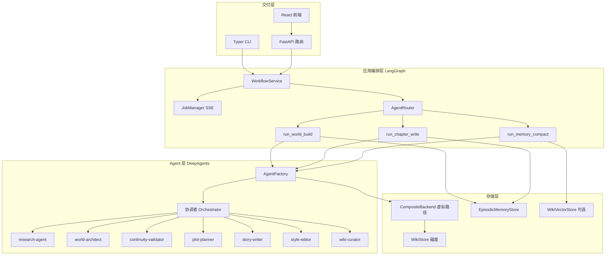
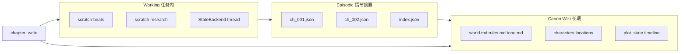

# RadishArticle 工作流与组件说明

本文档说明 RadishArticle 从用户输入到 Wiki/章节落盘的**完整工作过程**，以及各层组件的职责与协作关系。适合第一次阅读代码或二次开发时对照。

---

## 1. 系统目标

RadishArticle 要解决的核心问题是：**长篇小说创作中设定与剧情会不断累积，如何让 AI 在写每一章时既记得住世界规则，又不会被超长上下文拖垮。**

为此系统采用：

| 能力 | 实现方式 |
|------|----------|
| 持久化世界观与剧情 | 本地 **LLM Wiki**（Markdown + YAML frontmatter） |
| 科学记忆 | **三层记忆**：Canon Wiki / Episodic / Working |
| 多角色协作 | **DeepAgents** 协调者 + 7 个专家子 Agent |
| 业务编排 | **LangGraph** `AgentRouter` 分流三条流水线 |
| 交付 | CLI、FastAPI（含 SSE）、React 前端 |

---

## 2. 总体架构（两层图）

系统里实际存在**两层「图」**，不要混淆：



**第一层（LangGraph `AgentRouter`）**：只做「选哪条业务线」——世界观构建、写章、记忆整理。  
**第二层（DeepAgents）**：在选定业务线内部，由协调者通过 `task` 工具委派专家子 Agent，读写虚拟文件系统。

---

## 3. 一次请求的完整生命周期

以「用户在前端点击构建世界观」为例：

```
用户提交表单
  → POST /api/projects/{id}/world-build
  → workflows.py 创建 Job，asyncio 后台执行
  → WorkflowService.run_world_build_async
  → JobManager 记录 job_id，事件写入 Queue
  → AgentRouter.run(WORLD_BUILD)
  → run_world_build()
       · 读取 meta/bootstrap.json
       · 拼装「协调者任务书」prompt
       · AgentFactory.invoke_orchestrator(prompt, thread_id=world-{id})
  → DeepAgents 协调者运行（多轮 tool call）
       · write_todos / task / read_file / write_file ...
       · 子 Agent 写入 /wiki/、/scratch/ 等
  → run_world_build 返回 result
  → JobManager.complete，SSE 推送 stage=done
  → 前端 Wiki 浏览器可看到 wiki/canon/*.md
```

**同步路径（CLI）**：跳过 `JobManager`，直接 `WorkflowService.run_world_build_sync` → `AgentRouter.run`。

---

## 4. 组件清单与职责

### 4.1 交付层

| 组件 | 路径 | 作用 |
|------|------|------|
| **React 前端** | `frontend/src/` | 项目列表、世界观工作台、章节编辑器、Wiki 浏览器；通过 `/api` 代理调用后端，长任务订阅 SSE |
| **FastAPI** | `backend/app/main.py` | HTTP 入口、CORS、挂载路由 |
| **路由 - projects** | `routers/projects.py` | 创建/列出小说项目 |
| **路由 - workflows** | `routers/workflows.py` | 触发 world-build、chapter-write、memory-compact |
| **路由 - wiki** | `routers/wiki.py` | 只读浏览 Wiki 树与单文件内容 |
| **路由 - jobs** | `routers/jobs.py` | 查询任务状态、`/stream` SSE 推送进度 |
| **Typer CLI** | `cli/radish_article_cli.py` | 与 API 共用 `WorkflowService`，适合脚本化与本地调试 |

### 4.2 应用服务层

| 组件 | 路径 | 作用 |
|------|------|------|
| **WorkflowService** | `services/workflow_service.py` | API/CLI 的统一业务入口；封装 `AgentRouter` + 异步 Job |
| **ProjectService** | `services/project_service.py` | 项目 CRUD、`WikiStore` 实例获取 |
| **JobManager** | `services/job_manager.py` | 内存中的 job 状态与 `asyncio.Queue`；把流水线 `emit(stage)` 转为 SSE 事件 |
| **配置 Settings** | `config.py` | 模型名、API Key、`DATA_ROOT`、Chroma/LangSmith 开关 |

### 4.3 编排层（LangGraph）

| 组件 | 路径 | 作用 |
|------|------|------|
| **AgentRouter** | `orchestration/router.py` | `StateGraph`：`task_type` → `world_build` / `chapter_write` / `memory_compact` 三节点之一 |
| **run_world_build** | `orchestration/world_build.py` | 拼 bootstrap 上下文 → 调协调者；无 API Key 时 `_fallback_world_build` |
| **run_chapter_write** | `orchestration/chapter_write.py` | 拼章节上下文 → 调协调者；兜底写 episodic |
| **run_memory_compact** | `orchestration/memory_compact.py` | Python 规则整理 + Chroma 重建 + 可选 curator Agent |

### 4.4 Agent 层（DeepAgents）

| 组件 | 路径 | 作用 |
|------|------|------|
| **AgentFactory** | `agents/factory.py` | `create_deep_agent`、注册 `subagents`、`invoke_orchestrator` / `stream_orchestrator` |
| **prompts** | `agents/prompts.py` | 协调者与 7 个子 Agent 的 system prompt；约定读写哪些虚拟路径 |
| **internet_search** | `tools/web_search.py` | Tavily 或 DuckDuckGo 背景调研 |
| **make_wiki_tools** | `tools/wiki_tools.py` | 直接读 `WikiStore` 的 wiki_read / wiki_list / wiki_search（关键词） |
| **make_vector_search_tool** | `tools/vector_search.py` | Chroma 语义检索 wiki |

**协调者（Orchestrator）** 内置能力（无需手写）：

- `write_todos`：任务拆解  
- `task`：调用子 Agent（名称对应 `factory._subagents()` 里的 `name`）  
- `ls` / `read_file` / `write_file` / `edit_file`：通过 `backend` 操作虚拟路径  
- `SummarizationMiddleware`：对话过长时压缩历史  

**七个子 Agent**：

| name | 典型阶段 | 主要产出路径 |
|------|----------|--------------|
| `research-agent` | 世界观 / 需考据时 | `/scratch/research_notes.md` |
| `world-architect` | 世界观构建 | `/wiki/canon/`、`/wiki/characters/`、`/wiki/locations/` |
| `continuity-validator` | 构建后 / 写章后 | `/scratch/validation_report.json` |
| `plot-planner` | 写章 | `/scratch/beats.md` |
| `story-writer` | 写章 | `/chapters/ch_NNN.md` |
| `style-editor` | 写章 | 润色同一章节文件 |
| `wiki-curator` | 构建末 / 写章末 | 更新 `plot_state`、`timeline`、episodic |

子 Agent 的**调用顺序不由 Python 硬编码**，而是由发给协调者的 prompt 里「步骤 1、2、3…」约束；协调者自主决定何时 `task` 委派。

### 4.5 存储与记忆层

| 组件 | 路径 | 作用 |
|------|------|------|
| **WikiStore** | `memory/wiki_store.py` | 项目目录生命周期；读写 `meta/`、`wiki/`、`chapters/`；Markdown frontmatter |
| **create_project_backend** | `memory/backends.py` | `CompositeBackend`：虚拟路径 → 磁盘或 State |
| **EpisodicMemoryStore** | `memory/episodic.py` | 章节摘要 JSON、`plot_state` 追加、`build_chapter_context` |
| **MemoryCompactor** | `memory/compact.py` | 实体去重、plot 裁剪、episodic 卷归档 |
| **WikiVectorStore** | `memory/vector_store.py` | Chroma 持久化索引，供语义检索 |
| **schemas** | `memory/schemas.py` | `EpisodicRecord`、`ChapterContext` 等数据结构 |

---

## 5. 虚拟文件系统（Agent 眼中的路径）

Agent 通过 DeepAgents 文件工具访问的路径与磁盘对应关系：

| 虚拟路径前缀 | Backend 类型 | 磁盘位置 | 用途 |
|--------------|--------------|----------|------|
| `/wiki/` | FilesystemBackend | `data/projects/{id}/wiki/` | 长期设定：canon、人物、地点、plot_state |
| `/chapters/` | FilesystemBackend | `.../chapters/` | 章节正文 |
| `/meta/` | FilesystemBackend | `.../meta/` | project.json、bootstrap.json |
| `/memory/` | FilesystemBackend | `.../memory/` | episodic JSON、index.json |
| `/scratch/` 及其他 | StateBackend（默认） | LangGraph 线程状态 | 调研笔记、beats、校验报告（任务内临时） |

`virtual_mode=True` 限制 Agent 不能逃出项目目录，避免误写宿主机其他路径。

**两套写 Wiki 的方式**：

1. Agent 用内置 `write_file` → 走 `CompositeBackend` → 落到磁盘  
2. Python 用 `WikiStore.write_markdown` → 直接写磁盘（fallback、episodic 兜底）

---

## 6. 三层记忆模型



| 层级 | 存储 | 写入者 | 读入写章上下文的方式 |
|------|------|--------|----------------------|
| **Canon Wiki** | `wiki/canon/` 等，`canon_level: hard` 需谨慎修改 | world-architect、wiki-curator（校验后） | `plot_state` 截断 + 人物卡路径提示 |
| **Episodic** | `memory/episodic/ch_NNN.json` | wiki-curator 或 Python 兜底 | `build_chapter_context` 注入上一章摘要 |
| **Working** | `/scratch/`（StateBackend） | 各子 Agent 中间产物 | 不跨章持久；thread 结束可丢弃 |

**原则**：禁止把全部历史章节正文塞进 prompt；用摘要链 + 按需加载人物/地点文件。

**memory_compact 流水线**额外做：实体索引去重、过长 `plot_state` 归档、旧 episodic 卷归档、Chroma 全量 reindex。

---

## 7. 三条业务流水线详解

### 7.1 世界观构建（world_build）

**触发**：`POST .../world-build`、CLI `world-build`、前端「世界观工作台」。

**输入**：创建项目时写入的 `meta/bootstrap.json`（标题、大纲、基调、背景、人设等）。

**过程**：

1. `run_world_build` 读取 bootstrap，生成协调者 prompt（含 4 步委派说明）。  
2. `AgentFactory.invoke_orchestrator(..., thread_id="world-{project_id}")`。  
3. 协调者典型委派链：  
   - `research-agent` → 搜索工具 → `/scratch/research_notes.md`  
   - `world-architect` → `/wiki/canon/world.md` 等  
   - `continuity-validator` → `/scratch/validation_report.json`  
   - `wiki-curator` → 初始化或更新 `wiki/plot_state.md`  
4. 向 Job SSE 发送粗粒度阶段：`research` → `world_architect` → `validate` → `wiki_curator`。  
5. 返回 `{ mode: "agent", validation, messages }` 或 fallback。

**无 API Key 时**：`_fallback_world_build` 用 Python 根据 bootstrap 写入最小 canon 集，便于学习目录结构。

### 7.2 章节写作（chapter_write）

**触发**：`POST .../chapters`、`CLI write-chapter`、前端「章节编辑器」。

**输入**：可选 `outline`、`auto_plot`、`chapter_number`、`title`、`pov`。

**过程**：

1. 确定章节号与文件名 `ch_NNN.md`。  
2. `EpisodicMemoryStore.build_chapter_context` 组装：  
   - `plot_state`（截断）  
   - 上一章 `episodic` 摘要  
   - 相关人物/地点 wiki 路径列表  
3. 拼协调者 prompt（5 步：plot-planner → writer → validator → style → curator）。  
4. `invoke_orchestrator(..., thread_id="chapter-{id}-{num}")` 隔离 scratch。  
5. 若 Agent 未写 episodic，Python 用 `_build_episodic_from_chapter` 兜底并 `update_plot_state`。  

**输出**：`chapters/ch_NNN.md`、`memory/episodic/ch_NNN.json`、更新的 `plot_state`。

### 7.3 记忆整理（memory_compact）

**触发**：`POST .../memory/compact`、CLI `compact-memory`。

**过程**：

1. `MemoryCompactor.run()`：去重 `memory/index.json`、裁剪 `plot_state`、可选 episodic 卷归档。  
2. `WikiVectorStore.index_wiki()`：Chroma 重建（`CHROMA_ENABLED=true` 时）。  
3. 可选：协调者委派 `wiki-curator` 写 `/scratch/compact_report.md`。

---

## 8. 项目目录结构（数据契约）

每个小说项目对应 `data/projects/{novel_id}/`：

```
{novel_id}/
├── meta/
│   ├── project.json       # 标题、类型、创建时间
│   └── bootstrap.json     # 用户原始输入（工作流种子）
├── wiki/
│   ├── canon/             # 铁律级设定（hard）
│   │   ├── world.md
│   │   ├── rules.md
│   │   └── tone.md
│   ├── characters/        # 人物卡
│   ├── locations/
│   ├── factions/
│   ├── timeline.md
│   └── plot_state.md      # 滚动剧情进度（soft，频繁更新）
├── chapters/
│   └── ch_001.md          # 章节正文 + frontmatter
├── memory/
│   ├── episodic/          # 每章结构化摘要 JSON
│   ├── index.json         # 实体 → 最后出现章节
│   └── archives/          # compact 归档
├── scratch/               # 部分中间件可能同步到磁盘（校验报告等）
├── exports/
└── .chroma/               # 向量库（可选）
```

Wiki 文档建议带 YAML frontmatter：`id`、`type`、`canon_level`、`last_updated`、`sources`。

---

## 9. API 与前端交互要点

| 端点 | 说明 |
|------|------|
| `POST /api/projects` | 创建项目 + 初始化目录 |
| `POST /api/projects/{id}/world-build` | 返回 `job_id`，后台跑 world_build |
| `POST /api/projects/{id}/chapters` | 写章任务 |
| `POST /api/projects/{id}/memory/compact` | 记忆整理 |
| `GET /api/projects/{id}/wiki/tree` | Wiki 目录树 |
| `GET /api/projects/{id}/wiki/file?path=...` | 单文件内容 |
| `GET /api/projects/{id}/jobs/{job_id}/stream` | SSE：`stage`、`message`、`progress` |

前端 `subscribeJob` 使用 `EventSource` 监听直至 `stage === "done"` 或 `"error"`。

---

## 10. 配置与环境变量

见根目录 [`.env.example`](../.env.example)：

| 变量 | 作用 |
|------|------|
| `OPENAI_API_KEY` | 启用完整 DeepAgents 流水线（必填才有真实 LLM 调用） |
| `LLM_MODEL` | 协调者与重任务子 Agent，如 `openai:gpt-4o-mini` |
| `LLM_MODEL_LIGHT` | 校验、润色等轻量任务 |
| `TAVILY_API_KEY` | 可选；未设置则 DuckDuckGo |
| `DATA_ROOT` | 项目数据根目录，默认 `data/projects` |
| `CHROMA_ENABLED` | 是否启用向量检索 |
| `LANGCHAIN_TRACING_V2` | LangSmith 追踪 |

---

## 11. 扩展与调试建议

| 目标 | 建议修改位置 |
|------|--------------|
| 新增子 Agent | `agents/prompts.py` + `factory._subagents()` + 协调者 prompt 步骤 |
| 新增业务流水线 | `models/schemas.TaskType` + `router.py` 节点 + `workflow_service.py` |
| 调整记忆策略 | `memory/episodic.py` 的 `build_chapter_context` |
| 更换模型提供商 | `config.py` + 安装对应 `langchain-*` 包 |
| 只调试单个专家 | `AgentFactory.create_specialist("plot-planner")` |

**调试顺序**：先 CLI `projects create` + `world-build`（观察 `data/projects/` 落盘），再开 API 与前端 SSE。

---

## 12. 相关源码索引

| 主题 | 文件 |
|------|------|
| 虚拟文件系统 | `backend/app/memory/backends.py` |
| Agent 组装 | `backend/app/agents/factory.py` |
| Prompt 约定 | `backend/app/agents/prompts.py` |
| 世界观流水线 | `backend/app/orchestration/world_build.py` |
| 章节流水线 | `backend/app/orchestration/chapter_write.py` |
| 路由图 | `backend/app/orchestration/router.py` |
| 服务入口 | `backend/app/services/workflow_service.py` |
| SSE | `backend/app/services/job_manager.py` |
| HTTP | `backend/app/routers/workflows.py` |

---

*文档版本与代码同步于 RadishArticle v0.1.0。*
